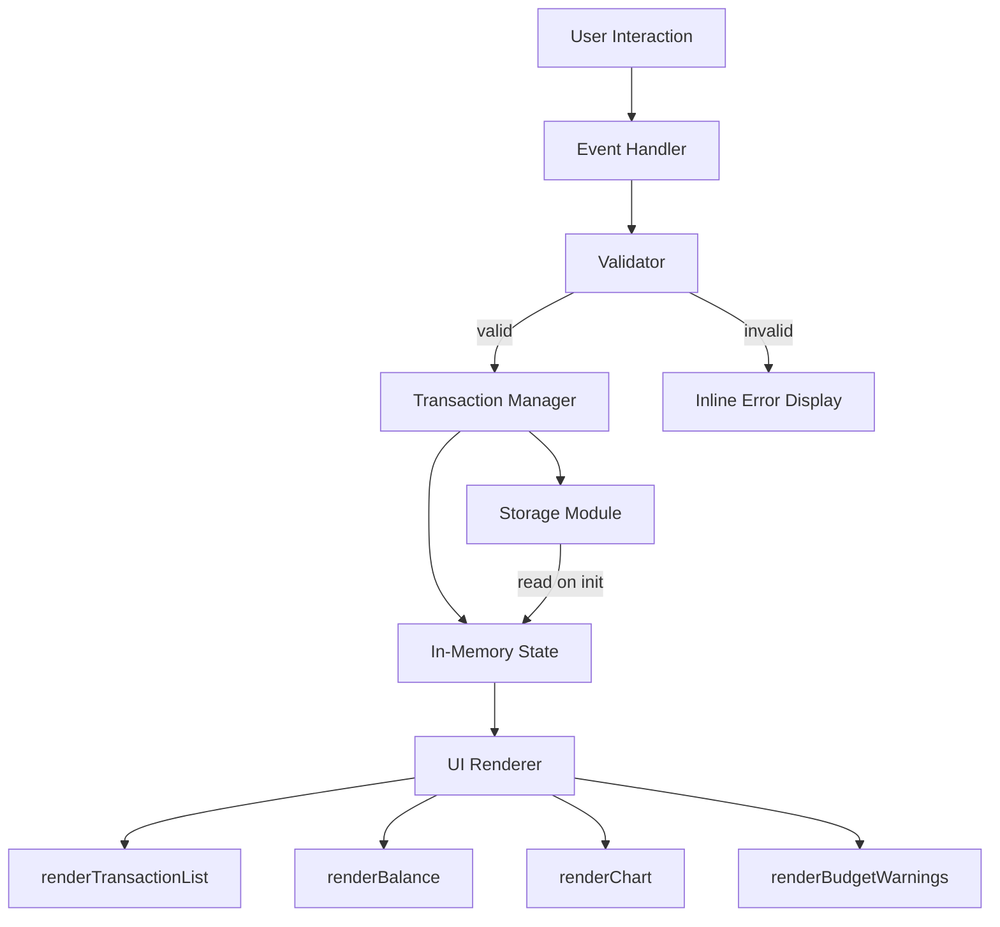

# Design Document: Expense & Budget Visualizer

## Overview

The Expense & Budget Visualizer is a single-page web application (SPA) built with plain HTML, CSS, and Vanilla JavaScript — no frameworks, no build tools. All behavior lives in one JS file (`app.js`), all styling in one CSS file (`style.css`), and the Chart.js library is loaded from a CDN. Data is persisted entirely in the browser's Local Storage API.

The app lets users:
- Record expense transactions (name, amount, category)
- View a scrollable transaction list with delete support
- See a live-updating pie chart of spending by category
- Track total balance
- Set per-category budget limits with visual warnings
- Sort transactions by date or amount
- Toggle between dark and light themes

All state changes (add, delete, sort, theme, budget limit) trigger a unified re-render cycle that updates the transaction list, balance display, chart, and budget warnings in one pass.

---

## Architecture

The app follows a simple **unidirectional data flow**:

```
User Action → Event Handler → State Mutation → Re-render
                                    ↕
                              Local Storage
```

There are no reactive frameworks. State is held in module-level variables inside `app.js`. Every mutation calls a `render()` orchestrator that updates all UI regions.



### Technology Stack

| Concern | Technology |
|---|---|
| Markup | HTML5 (semantic elements) |
| Styling | CSS3 (custom properties, grid, media queries) |
| Behavior | Vanilla JavaScript (ES6+) |
| Charting | Chart.js v4 via CDN |
| Persistence | Browser Local Storage API |

---

## Components and Interfaces

### File Structure

```
index.html      — Single HTML page, semantic structure
style.css       — All styling, CSS custom properties for theming
app.js          — All behavior, organized into logical modules
```

### HTML Structure (`index.html`)

```
<body>
  <header>
    <h1>Expense & Budget Visualizer</h1>
    <button id="theme-toggle">Toggle Theme</button>
  </header>

  <main class="grid-layout">
    <!-- Left column (desktop) -->
    <section id="input-section">
      <form id="transaction-form">
        <input id="item-name" type="text" maxlength="100" />
        <span id="error-name" class="error-msg"></span>

        <input id="item-amount" type="number" min="0.01" max="999999999.99" step="0.01" />
        <span id="error-amount" class="error-msg"></span>

        <select id="item-category">
          <option value="">-- Select Category --</option>
          <option value="Food">Food</option>
          <option value="Transport">Transport</option>
          <option value="Fun">Fun</option>
        </select>
        <span id="error-category" class="error-msg"></span>

        <button type="submit">Add Transaction</button>
      </form>

      <!-- Budget limit inputs -->
      <section id="budget-limits">
        <label>Food limit: <input type="number" id="limit-Food" /></label>
        <span id="error-limit-Food" class="error-msg"></span>
        <label>Transport limit: <input type="number" id="limit-Transport" /></label>
        <span id="error-limit-Transport" class="error-msg"></span>
        <label>Fun limit: <input type="number" id="limit-Fun" /></label>
        <span id="error-limit-Fun" class="error-msg"></span>
      </section>

      <!-- Sort control -->
      <section id="sort-section">
        <label for="sort-control">Sort by:</label>
        <select id="sort-control">
          <option value="date-desc">Date (Newest First)</option>
          <option value="date-asc">Date (Oldest First)</option>
          <option value="amount-desc">Amount (Highest First)</option>
          <option value="amount-asc">Amount (Lowest First)</option>
        </select>
      </section>
    </section>

    <!-- Right column (desktop) -->
    <section id="list-section">
      <div id="transaction-list"></div>
    </section>

    <!-- Bottom row (desktop), stacked below on mobile -->
    <section id="balance-section">
      <p id="balance-display">Total: $0.00</p>
    </section>

    <section id="chart-section">
      <canvas id="spending-chart"></canvas>
      <p id="chart-empty-msg" hidden>No data available</p>
    </section>
  </main>

  <div id="toast-error" class="toast hidden"></div>

  <script src="https://cdn.jsdelivr.net/npm/chart.js@4"></script>
  <script src="app.js"></script>
</body>
```

### JavaScript Module Interfaces (`app.js`)

All code lives in a single IIFE or module scope to avoid polluting the global namespace.

#### Storage Module

```js
// Reads transactions array from localStorage; returns [] on failure or missing key
function loadTransactions(): Transaction[]

// Serializes transactions array to localStorage; throws/logs on failure
function saveTransactions(transactions: Transaction[]): void

// Returns 'dark' | 'light'; defaults to 'light' on missing/invalid value
function loadTheme(): string

// Persists theme string to localStorage; silently catches write errors
function saveTheme(theme: string): void

// Returns BudgetLimits object; returns { Food: null, Transport: null, Fun: null } on failure
function loadBudgetLimits(): BudgetLimits

// Persists budget limits to localStorage; silently catches write errors
function saveBudgetLimits(limits: BudgetLimits): void
```

#### Validator

```js
// Returns { valid: boolean, errors: { name?: string, amount?: string, category?: string } }
function validateForm(name: string, amount: string, category: string): ValidationResult
```

#### Transaction Manager

```js
// Creates a new Transaction, pushes to state, saves to storage, triggers render
function addTransaction(name: string, amount: number, category: string): void

// Removes transaction by id from state, saves to storage, triggers render
// On storage failure: shows toast error, does NOT remove from state
function deleteTransaction(id: string): void

// Returns a copy of transactions sorted/filtered per current sort selection
function getFilteredSorted(transactions: Transaction[], sortKey: string): Transaction[]
```

#### UI Renderer

```js
// Clears and rebuilds the #transaction-list DOM; shows empty-state message when needed
function renderTransactionList(transactions: Transaction[]): void

// Updates #balance-display with formatted currency total
function renderBalance(transactions: Transaction[]): void

// Destroys existing Chart.js instance (if any) and recreates with current data;
// shows #chart-empty-msg and hides canvas when transactions is empty
function renderChart(transactions: Transaction[]): void

// Applies/removes warning CSS classes on transaction rows and chart segments
function renderBudgetWarnings(transactions: Transaction[], limits: BudgetLimits): void
```

#### Event Handlers

```js
// form#transaction-form 'submit' → validateForm → addTransaction → resetForm
// button.delete-btn 'click' (delegated on #transaction-list) → deleteTransaction
// select#sort-control 'change' → re-render list in new order
// button#theme-toggle 'click' → toggle theme class on <body>, saveTheme
// input[id^="limit-"] 'input' → validate limit value → saveBudgetLimits → renderBudgetWarnings
```

#### App Init

```js
// Entry point called on DOMContentLoaded:
// 1. loadTransactions → set state
// 2. loadTheme → apply to <body>
// 3. loadBudgetLimits → set state
// 4. Populate budget limit inputs from state
// 5. render() — calls all four render functions
// 6. Attach all event listeners
function init(): void
```

---

## Data Models

### Transaction

```js
{
  id: string,          // crypto.randomUUID() or Date.now().toString() fallback
  name: string,        // 1–100 characters, trimmed
  amount: number,      // float, 0.01–999999999.99
  category: string,    // 'Food' | 'Transport' | 'Fun'
  timestamp: number    // Date.now() at creation time, used for date sorting
}
```

### BudgetLimits

```js
{
  Food: number | null,       // null means no limit set
  Transport: number | null,
  Fun: number | null
}
```

### AppState (module-level variables)

```js
let transactions: Transaction[] = []
let budgetLimits: BudgetLimits = { Food: null, Transport: null, Fun: null }
let currentSort: string = 'date-desc'
let currentTheme: string = 'light'
let chartInstance: Chart | null = null
```

### Local Storage Keys

| Key | Value |
|---|---|
| `ebv_transactions` | JSON array of Transaction objects |
| `ebv_theme` | `'light'` or `'dark'` |
| `ebv_budget_limits` | JSON object of BudgetLimits |

---

## CSS Design

### Theming with CSS Custom Properties

```css
:root {
  --bg-primary: #ffffff;
  --bg-secondary: #f5f5f5;
  --text-primary: #1a1a1a;
  --text-secondary: #555555;
  --accent: #4a90e2;
  --warning: #e25c4a;
  --border: #dddddd;
  --shadow: rgba(0,0,0,0.08);
}

body.dark {
  --bg-primary: #1e1e2e;
  --bg-secondary: #2a2a3e;
  --text-primary: #e0e0f0;
  --text-secondary: #a0a0c0;
  --accent: #7aa2f7;
  --warning: #f7768e;
  --border: #3a3a5e;
  --shadow: rgba(0,0,0,0.4);
}
```

Theme switching is done by toggling the `dark` class on `<body>`. All components reference only CSS custom properties, so the entire UI repaints instantly.

### Responsive Grid Layout

```css
/* Desktop: two-column grid */
.grid-layout {
  display: grid;
  grid-template-columns: 1fr 1fr;
  grid-template-rows: auto auto;
  gap: 1.5rem;
}

/* #input-section and #list-section sit in row 1 */
/* #balance-section and #chart-section sit in row 2 */

/* Mobile: single column */
@media (max-width: 600px) {
  .grid-layout {
    grid-template-columns: 1fr;
  }
}
```

### Transaction List Scroll Containment

```css
#transaction-list {
  max-height: 400px;
  overflow-y: auto;
  /* Prevents layout shift when list grows */
}
```

### Mobile Tap Targets

```css
@media (max-width: 600px) {
  button,
  input,
  select {
    min-height: 44px;
    min-width: 44px;
  }
}
```

---

## Chart.js Integration

### Library Loading

```html
<script src="https://cdn.jsdelivr.net/npm/chart.js@4"></script>
```

### Chart Instance Management

The chart instance is stored in the module-level `chartInstance` variable. The update strategy is **destroy + recreate** on every render call. This avoids Chart.js animation state bugs when categories appear/disappear:

```js
function renderChart(transactions) {
  const canvas = document.getElementById('spending-chart');
  const emptyMsg = document.getElementById('chart-empty-msg');

  // Aggregate spending by category
  const totals = { Food: 0, Transport: 0, Fun: 0 };
  transactions.forEach(t => { totals[t.category] += t.amount; });

  const activeCategories = Object.entries(totals).filter(([, v]) => v > 0);

  // Empty state
  if (activeCategories.length === 0) {
    if (chartInstance) { chartInstance.destroy(); chartInstance = null; }
    canvas.hidden = true;
    emptyMsg.hidden = false;
    return;
  }

  canvas.hidden = false;
  emptyMsg.hidden = true;

  // Destroy previous instance before recreating
  if (chartInstance) { chartInstance.destroy(); }

  const COLORS = { Food: '#4a90e2', Transport: '#e2a84a', Fun: '#7ed957' };
  const WARNING_COLORS = { Food: '#e25c4a', Transport: '#c0392b', Fun: '#e74c3c' };

  // Determine if any category is over budget (for warning color on chart segment)
  const categoryTotals = { Food: 0, Transport: 0, Fun: 0 };
  transactions.forEach(t => { categoryTotals[t.category] += t.amount; });

  const labels = activeCategories.map(([k]) => k);
  const data = activeCategories.map(([, v]) => v);
  const backgroundColors = activeCategories.map(([k]) => {
    const limit = budgetLimits[k];
    return (limit !== null && categoryTotals[k] > limit)
      ? WARNING_COLORS[k]
      : COLORS[k];
  });

  chartInstance = new Chart(canvas, {
    type: 'pie',
    data: {
      labels,
      datasets: [{ data, backgroundColor: backgroundColors }]
    },
    options: {
      plugins: {
        legend: {
          display: true,
          position: 'bottom',
          labels: {
            generateLabels(chart) {
              const total = data.reduce((a, b) => a + b, 0);
              return chart.data.labels.map((label, i) => ({
                text: `${label}: ${((data[i] / total) * 100).toFixed(1)}%`,
                fillStyle: backgroundColors[i],
                index: i
              }));
            }
          }
        }
      }
    }
  });
}
```

### Empty State

When `transactions` is empty (or all category totals are zero), the canvas is hidden and a `<p id="chart-empty-msg">` element is shown with the text "No data available".

---

## Error Handling

### Storage Failures

All Local Storage operations are wrapped in `try/catch` blocks:

```js
function saveTransactions(transactions) {
  try {
    localStorage.setItem('ebv_transactions', JSON.stringify(transactions));
  } catch (e) {
    // QuotaExceededError or SecurityError
    showToast('Failed to save transactions. Storage may be full.');
    // In-memory state is NOT rolled back — UI stays consistent
  }
}

function loadTransactions() {
  try {
    const raw = localStorage.getItem('ebv_transactions');
    if (!raw) return [];
    const parsed = JSON.parse(raw);
    // Validate shape: must be an array of objects with required fields
    if (!Array.isArray(parsed)) return [];
    return parsed.filter(t =>
      typeof t.id === 'string' &&
      typeof t.name === 'string' &&
      typeof t.amount === 'number' &&
      typeof t.category === 'string' &&
      typeof t.timestamp === 'number'
    );
  } catch (e) {
    // JSON.parse failure = corrupted data
    showToast('Stored data was corrupted and has been cleared.');
    return [];
  }
}
```

### Delete Failure

When `deleteTransaction` fails to persist to storage, the transaction is **not** removed from the in-memory state and a toast error is shown. The UI reflects the retained state.

### Toast Error Display

```js
function showToast(message) {
  const toast = document.getElementById('toast-error');
  toast.textContent = message;
  toast.classList.remove('hidden');
  setTimeout(() => toast.classList.add('hidden'), 4000);
}
```

### Validation Errors

Inline error messages are rendered directly below each failing field using `<span class="error-msg">` elements. They are cleared on the next successful submission or when the field is corrected.

### Theme and Budget Limit Storage Failures

These are non-critical. On write failure, the app retains the current in-memory value for the session and silently logs the error to the console. No toast is shown for these since they don't affect transaction data integrity.

---

## Correctness Properties


*A property is a characteristic or behavior that should hold true across all valid executions of a system — essentially, a formal statement about what the system should do. Properties serve as the bridge between human-readable specifications and machine-verifiable correctness guarantees.*

### Property 1: Whitespace item names are rejected

*For any* string composed entirely of whitespace characters (including the empty string), `validateForm` SHALL return a validation error for the name field and SHALL NOT create a transaction.

**Validates: Requirements 1.3**

---

### Property 2: Invalid amounts are rejected, valid amounts are accepted

*For any* amount value that is ≤ 0, non-numeric, or greater than 999,999,999.99, `validateForm` SHALL return a validation error for the amount field. *For any* amount value in the range [0.01, 999,999,999.99], `validateForm` SHALL not return an amount error when name and category are valid.

**Validates: Requirements 1.4**

---

### Property 3: Valid transaction input is added to the list

*For any* valid (name, amount, category) triple, calling `addTransaction` SHALL result in the transactions array containing exactly one new entry whose name, amount, and category match the input, and the list length SHALL increase by exactly one.

**Validates: Requirements 1.6**

---

### Property 4: Transaction list renders all required fields

*For any* non-empty array of transactions, `renderTransactionList` SHALL produce DOM output that contains, for each transaction, the item name, the amount formatted as a currency string with exactly two decimal places (e.g., `$12.50`), the category label, and a delete button.

**Validates: Requirements 2.1, 2.6**

---

### Property 5: Delete removes the transaction from state

*For any* array of transactions and *any* transaction id present in that array, calling `deleteTransaction(id)` SHALL result in the transactions array no longer containing an entry with that id, and the array length SHALL decrease by exactly one.

**Validates: Requirements 2.7**

---

### Property 6: Balance display shows correct formatted sum

*For any* array of transactions, `renderBalance` SHALL display the arithmetic sum of all transaction amounts formatted with a `$` currency symbol, exactly two decimal places, and a thousands separator (e.g., `$1,234.56`). When the array is empty, the display SHALL show `$0.00`.

**Validates: Requirements 3.1, 3.4**

---

### Property 7: Chart data reflects per-category totals and excludes zero-total categories

*For any* array of transactions, the data passed to the Chart.js instance SHALL equal the sum of amounts grouped by category, and the chart labels SHALL include only categories whose total is greater than zero. Categories with a zero total SHALL be excluded from both labels and data arrays.

**Validates: Requirements 4.1, 4.5**

---

### Property 8: Storage round-trip preserves transaction data

*For any* array of valid Transaction objects, calling `saveTransactions` followed by `loadTransactions` SHALL return an array that is structurally equivalent to the original (same ids, names, amounts, categories, and timestamps), in the same order.

**Validates: Requirements 5.1, 5.2, 5.3**

---

### Property 9: Malformed storage data is discarded and returns empty array

*For any* string stored in `localStorage` under the transactions key that is not a valid JSON array of Transaction objects (including corrupted JSON, wrong types, missing required fields, or non-array values), `loadTransactions` SHALL return an empty array without throwing.

**Validates: Requirements 5.7**

---

### Property 10: Theme storage round-trip preserves theme value

*For any* theme value in `{'light', 'dark'}`, calling `saveTheme` followed by `loadTheme` SHALL return the same value. *For any* value not in `{'light', 'dark'}` (including missing, empty, or corrupted values), `loadTheme` SHALL return `'light'`.

**Validates: Requirements 7.3, 7.4**

---

### Property 11: Sort order is correct for all sort keys

*For any* non-empty array of transactions and *any* sort key (`date-desc`, `date-asc`, `amount-desc`, `amount-asc`), `getFilteredSorted` SHALL return all transactions in the correct order per the sort key. When two transactions have equal sort values, their relative order SHALL match their original insertion order (stable sort / tiebreak by timestamp).

**Validates: Requirements 8.2, 8.4**

---

### Property 12: Invalid budget limit values are rejected

*For any* budget limit input value that is empty, non-numeric, zero, negative, or greater than 999,999,999.99, the budget limit validation SHALL reject the value, display an inline error, and leave the `budgetLimits` state unchanged.

**Validates: Requirements 9.1, 9.5**

---

### Property 13: Over-budget categories receive warning indicators in both list and chart

*For any* array of transactions and budget limits where the total spending for a category exceeds its configured limit, `renderBudgetWarnings` SHALL apply a warning CSS class to every transaction row belonging to that category, and `renderChart` SHALL use the warning color for that category's pie segment. When the category total is at or below the limit (or no limit is set), no warning indicator SHALL be applied.

**Validates: Requirements 9.2, 9.3, 9.4**

---

## Testing Strategy

### Dual Testing Approach

Both unit tests and property-based tests are used. Unit tests cover specific examples, edge cases, and integration points. Property tests verify universal correctness across a wide input space.

### Property-Based Testing Library

**Recommended**: [fast-check](https://github.com/dubzzz/fast-check) (JavaScript/TypeScript, runs in Node.js with any test runner).

Each property test is configured to run a minimum of **100 iterations**.

Tag format for each property test:
```
// Feature: expense-budget-visualizer, Property N: <property_text>
```

### Property Test Mapping

| Property | fast-check Arbitraries | What Varies |
|---|---|---|
| P1: Whitespace name rejection | `fc.stringOf(fc.constantFrom(' ', '\t', '\n'))` | Whitespace string content and length |
| P2: Invalid/valid amount | `fc.float({ max: 0 })`, `fc.float({ min: 0.01, max: 999999999.99 })` | Amount values across valid/invalid ranges |
| P3: Valid transaction added | `fc.record({ name: fc.string({minLength:1}), amount: fc.float({min:0.01}), category: fc.constantFrom('Food','Transport','Fun') })` | All valid transaction shapes |
| P4: List renders all fields | `fc.array(transactionArbitrary, {minLength:1})` | Transaction arrays of varying size |
| P5: Delete removes transaction | `fc.array(transactionArbitrary, {minLength:1})` + pick random id | Any list, any transaction to delete |
| P6: Balance formatted sum | `fc.array(transactionArbitrary)` | Arrays of varying size and amounts |
| P7: Chart data correctness | `fc.array(transactionArbitrary)` | Transaction arrays with varying category distributions |
| P8: Storage round-trip | `fc.array(transactionArbitrary)` | Any valid transaction array |
| P9: Malformed storage discarded | `fc.string()`, `fc.integer()`, `fc.boolean()`, `fc.object()` | Any non-valid-array value |
| P10: Theme round-trip | `fc.constantFrom('light','dark')`, `fc.string()` | Valid and invalid theme strings |
| P11: Sort correctness | `fc.array(transactionArbitrary, {minLength:2})` + `fc.constantFrom(sortKeys)` | Any transaction array, any sort key |
| P12: Invalid budget limit rejected | `fc.oneof(fc.constant(0), fc.float({max:0}), fc.float({min:1000000000}))` | Out-of-range numeric values |
| P13: Budget warning indicators | `fc.array(transactionArbitrary, {minLength:1})` + budget limits | Any transaction/limit combination |

### Unit Test Coverage

Unit tests (using a standard runner like Jest or Vitest) cover:

- **Form validation**: Specific examples for each error message (empty name, zero amount, no category)
- **Empty states**: Empty transaction list shows placeholder; empty storage returns `$0.00` balance
- **Storage failure handling**: Mock `localStorage.setItem` to throw → toast shown, state retained
- **Chart empty state**: `renderChart([])` hides canvas, shows empty message
- **Theme toggle**: Clicking toggle adds/removes `dark` class on `<body>`
- **Delete confirmation**: No confirmation dialog appears before deletion
- **Budget limit inline errors**: Invalid input shows error span, valid input clears it

### Test File Structure

```
tests/
  unit/
    validator.test.js
    storage.test.js
    transactionManager.test.js
    renderer.test.js
  property/
    validator.property.test.js
    storage.property.test.js
    transactionManager.property.test.js
    renderer.property.test.js
    sort.property.test.js
    budget.property.test.js
```
